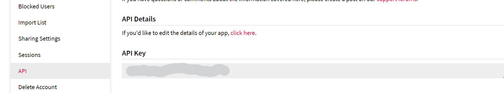

# Movie-box 🎬

A movie review web app showcasing current movies and TVshows. 

### 🏁 Getting Started

To get started, first you need to clone the repo then install the dependencies you need to run the app. Make sure you have [NodeJS](https://nodejs.org/en) from version 20 ^ installed. To install the dependence run this code in your terminal:

```
pnpm install 
# or
npm install
#or
yarn  
#or
bun install #recommended
```

While instating the dependencies, we need to get the free `API` key from [TMDB](https://www.themoviedb.org/settings/api) settings page [here](https://www.themoviedb.org/settings/api). To find your api key just goto the `Settings` page then click on `API ` from the sidebar options.



After you have gained your `API` key you can duplicate the `.env.example` file and rename the copy to `.env` then replace the value of `NEXT_PUBLIC_TMDB_API_KEY` with the  `API` key you got from [TMDB](https://www.themoviedb.org/settings/api).


Once thats done, you can run the the following command to start the app.

```
bun dev #recommended
# or
pnpm dev
# or
npm run dev
# or
yarn dev
```
,

This will start the app on [localhost:3000](http://localhost:3000) development server. 


### 📦 Packages used in the project

- [NextJS](https://nextjs.org/) to handle the backend and frontend of the application
- [React](https://reactjs.org/) for building user interfaces
- [React Query](https://react-query.tanstack.com/) for managing and caching server state
- [Axios](https://axios-http.com/) for making HTTP requests
- [Swiper](https://swiperjs.com/) for creating responsive and touch-friendly sliders
- [Tailwind CSS](https://tailwindcss.com/) for building responsive and customizable UI components
- [TypeScript](https://www.typescriptlang.org/) for static types in JavaScript

***


 <details>
 <summary> 🧠 Development Brainstorm Notes </summary>

#### Switching from react-query to NextJS 14's Server Actions

Considering the benefits of server actions in NextJS 14, such as improved performance and reduced bundle size, I'm considering switching from react-query to NextJS 14's server actions. This would involve refactoring most of the client components into server components.

#### Using AI in the App

Another area I'm exploring is integrating AI into the app. There could be several ways to incorporate AI, such as:

- Personalized recommendations: Using AI algorithms, we could provide personalized movie and TV show recommendations based on user preferences and behavior.
- Sentiment analysis: We could analyze user reviews and comments to determine sentiment and provide insights on popular opinions.
- Predictive analytics: AI could be used to predict trends in movie and TV show ratings and popularity over time.

Please note that these are just ideas and would require further research and planning.
</details>

